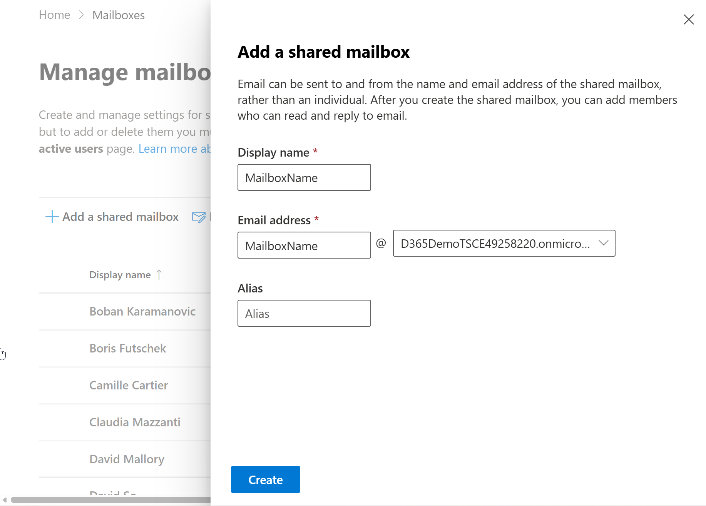
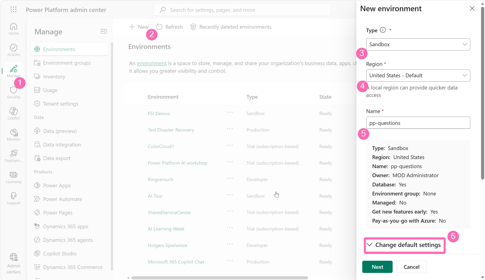
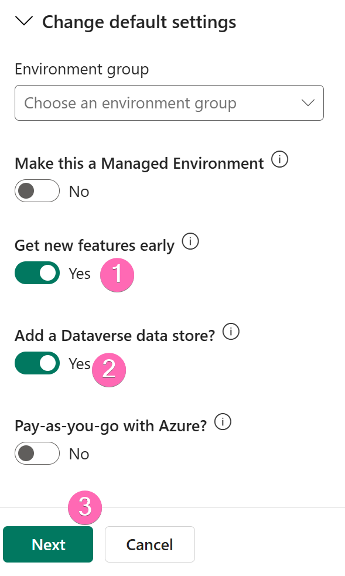
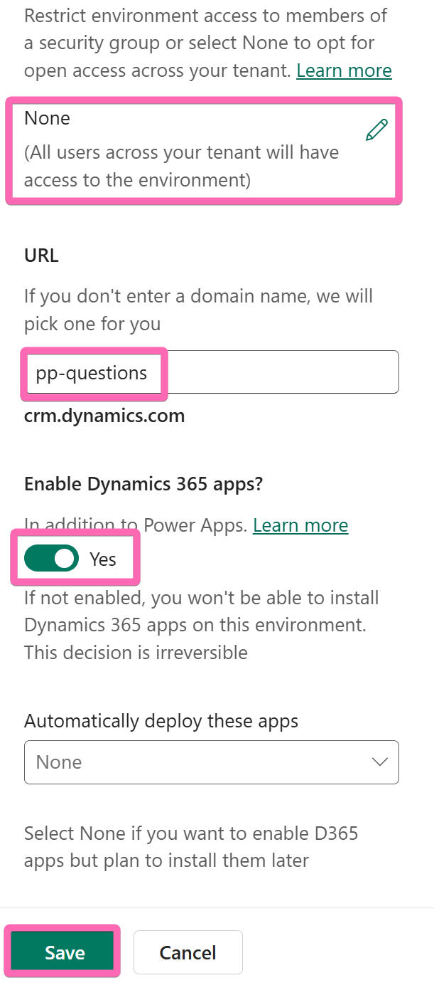
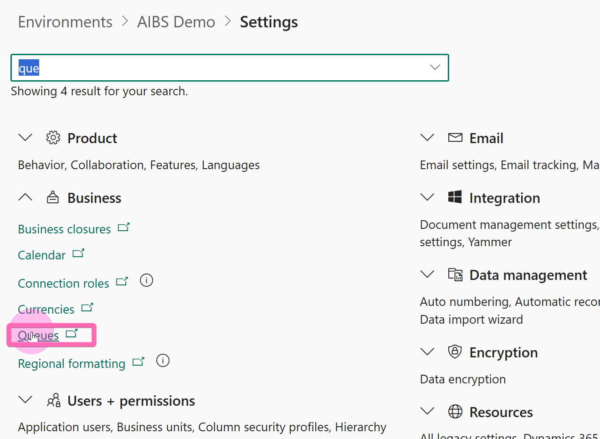
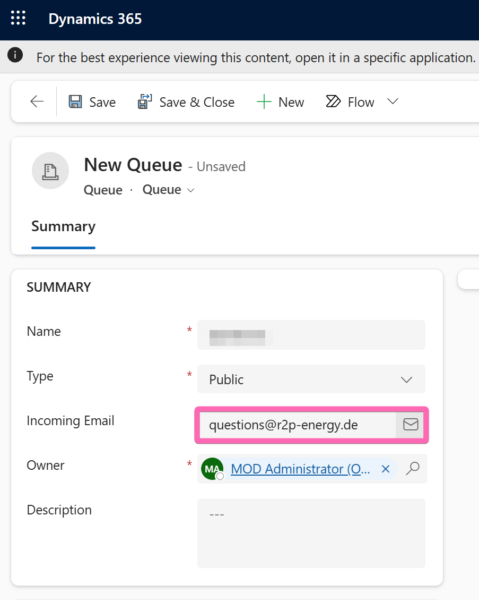
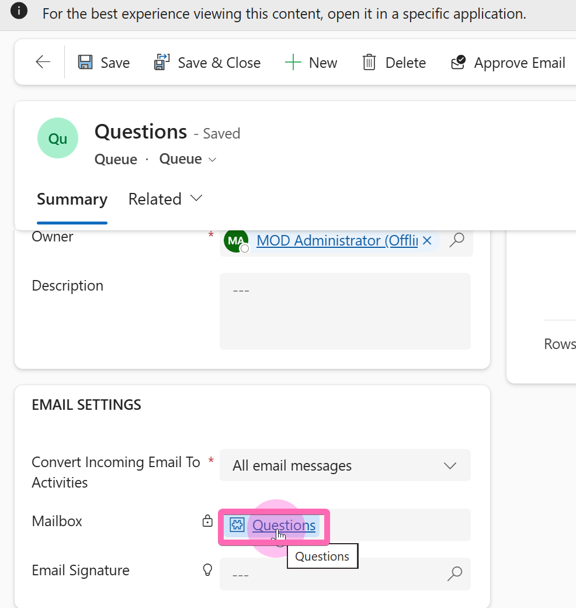
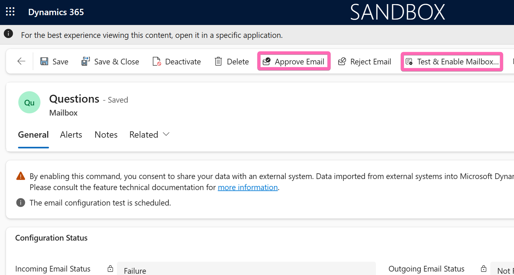
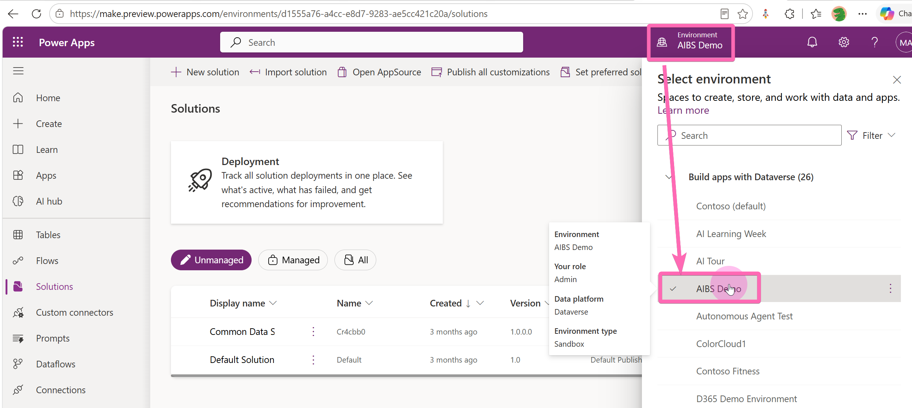

# Request Responder — Setup Guide

This guide walks you through setting up the **Request Responder** solution end-to-end. You will create a shared mailbox, provision a Dataverse environment, sync the mailbox so incoming emails land in Dataverse automatically, and finally import the solution.

---

## Prerequisites

- Admin access to the [Microsoft 365 Admin Center](https://admin.cloud.microsoft)
- Admin access to the [Power Platform Admin Center](https://admin.powerplatform.microsoft.com/)
- Access to [Power Apps](https://make.preview.powerapps.com/)

---

## Step 1 — Create a Shared Mailbox

1. Open the **Exchange Admin Center** at [https://admin.cloud.microsoft/exchange#/mailboxes](https://admin.cloud.microsoft/exchange#/mailboxes).
2. Click **Add a shared mailbox**.
3. Fill in a **Display name** and **Email address** for the mailbox, then click **Create**.
4. **Write down the email address** — you will need it in a later step.

5. After the mailbox is created, add users to the shared mailbox and grant them **delegation permissions** (Send As / Send on Behalf). This lets those users see the mailbox in Outlook and send replies on its behalf.

---

## Step 2 — Create a Power Platform Environment

1. Open the **Power Platform Admin Center** at [https://admin.powerplatform.microsoft.com/](https://admin.powerplatform.microsoft.com/).
2. In the left navigation, click **Manage** → **Environments**.
3. Click **+ New** in the command bar.
4. Set the **Type** to **Sandbox**.
5. Choose a **Region** close to your users (a local region gives faster data access).
6. Give the environment a descriptive **Name**.
7. Expand **Change default settings** at the bottom before clicking Next.

8. In the advanced settings, make sure to enable the following two toggles — they are critical:
   - **Get new features early** → **Yes**
   - **Add a Dataverse data store** → **Yes**
9. Click **Next** to continue.

10. On the next page, configure these settings:
    - **Security Group** — Select **None** (Open Access) so all users in your tenant can access the environment.
    - **URL** — Optionally customize the environment URL to something memorable.
    - **Enable Dynamics 365 apps** — Toggle this to **Yes**. This setting is **irreversible** — once the environment is created without D365 apps enabled, you cannot turn it on later.
    - **Automatically deploy these apps** — Set to **None** if you want to install apps manually later.
11. Click **Save** to start provisioning.

> **Tip:** Provisioning usually takes a few minutes. Wait until the environment state shows **Ready** before continuing.

---

## Step 3 — Sync the Mailbox to Dataverse

Now you will connect the shared mailbox to your new environment so that all incoming emails are automatically synced into Dataverse as email activities.

### 3a — Create a Queue

1. In the Power Platform Admin Center, click on your newly created environment.
2. Click **Settings** in the top command bar.
3. Search for or expand the **Business** section and click **Queues**.

4. Click **+ New** to create a new Queue.
5. Enter a **Name** for the queue (e.g., "Questions" or "Support Requests").
6. In the **Incoming Email** field, type the **email address of the shared mailbox** you created in Step 1.
7. Click **Save**.

### 3b — Approve and Enable the Mailbox

Saving the Queue automatically creates a linked **Mailbox** record in Dataverse.

1. After saving the Queue, scroll down to the **Email Settings** section.
2. Click on the linked **Mailbox** record to open it.

3. In the Mailbox form, click the **Approve Email** button in the command bar to approve the mailbox for email processing.
4. Then click **Test & Enable Mailbox** to schedule a connectivity test.
5. **Wait a few minutes**, then refresh the page to verify that the test completed successfully (the Incoming/Outgoing Email Status fields should show **Success**).

> **Note:** If the test shows a failure, double-check that the shared mailbox email address is correct and that Server-Side Synchronization is configured for your organization.

---

## Step 4 — Import the Solution

1. Open [https://make.preview.powerapps.com/](https://make.preview.powerapps.com/).
2. Click the **Environment** picker in the top-right corner and select the environment you created in Step 2.

3. In the left navigation, click **Solutions**.
4. Click **Import solution** in the command bar.
5. Browse to and upload the solution file:
   **[MailResponseAgent_1_0_0_2.zip](solution/MailResponseAgent_1_0_0_2.zip)**
6. Follow the on-screen prompts to complete the import.

---

## You're All Set!

Once the solution is imported successfully, the Request Responder agent is ready to use. Incoming emails to your shared mailbox will be synced into Dataverse and a response will be drafted by the agent.

